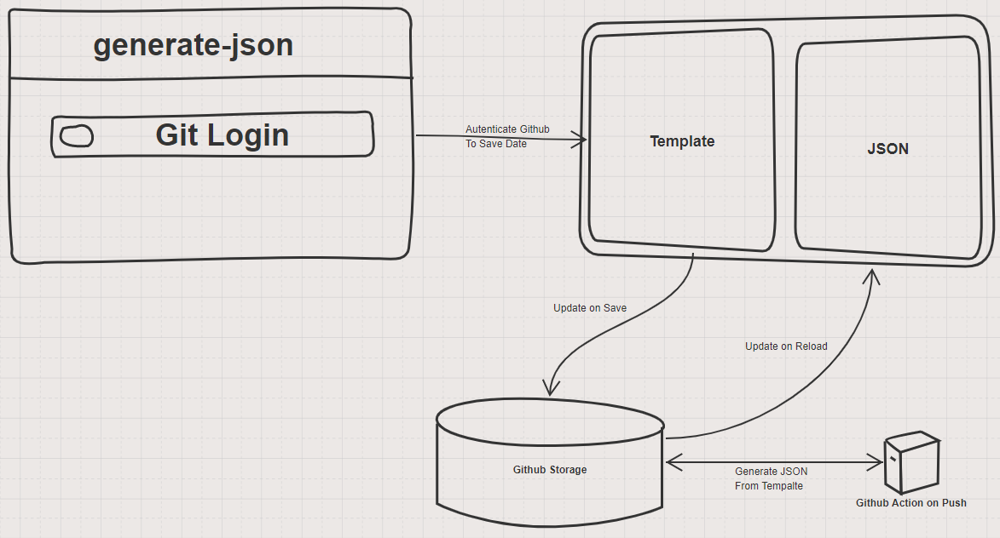

# Generate JSON

## Overview
- This project is an extension of project [dummy-json](https://github.com/webroo/dummy-json#api)
- Idea of this project is to generate json based on template.

## Problem Statement
- Most of JSON online generators are using javascript for generation of JSON. 
- This is hanging browser if we generate a huge file.

## Design
- Used GithubPages to host this page.
- Used Github Actions to generate json based on input provided.
- Used Github RestAPI and OAUTH WebApp to Login and update Template.
- JSON generation is based on [dummy-json](https://github.com/webroo/dummy-json#api).

## Architecture

## Demo
- [Live URL](https://rahulkirangaddam.is-a.dev/generate-json/)
[Demo](./images/02-Demo.gif)